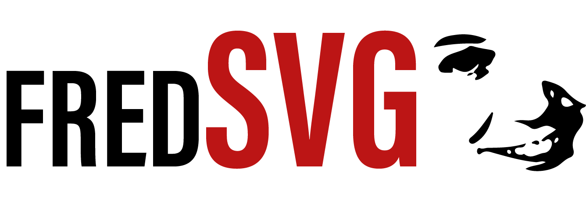

# Description

FredSVG parses SVG files into data structures that are useful to graphics and physics engines. In short, it can help you use SVG files as a file format for video game levels.

It is integration-agnostic, meaning it can be used in any game development system that supports Javascript, including browsers, Node.js, Unity, and more.

# Installation

FredSVG is installed through the Node Package Manager (npm):

``` shell
$ npm install fred-svg --save
```

# Getting Started

## Flat Layers Example

``` javascript
import Fred from "fred-svg";

/**
 * level.svg contains 3 layers called:
 *   "foreground"
 *   "physics: solid, density=1.0, friction=0.5"
 *   "background"
 */
const level = new Fred("./svg/level.svg");

level.layers; // ["foreground", "physics", "background"]

level.physics.density; // 1.0
level.physics.friction; // 0.5
```

## Nested Layers Example

``` javascript
import Fred from "fred-svg";

/**
 * level.svg contains nested layer like so:
 *   "foreground"
 *       "trees"
 *   "stage: solid, density=1.0, friction=0.5"
 *       "player: cameraLock"
 *       "ambient"
 *           "bugs"
 *           "birds"
 *   "npcs"
 *   		 		 "shopkeeper"
 *   		 		 "innkeeper"
 *   		 "items:interactive"
 *   		     "rocks"
 *   		 "environment:interactive"
 *   		 	   "ground"
 *   		     "ice: friction=0.0"
 *   "background"
 *       "mountains"
 *       "sky"
 */
const level = new Fred("./svg/level.svg");

level.layers; // ["foreground", "stage", "background"]

level.foreground.layers; // ["trees"]
level.stage.layers; // ["player", "ambient", "npcs", "items", "environment"]
level.background.layers; // ["mountains", "sky"]

level.stage.player.cameraLock; // true

level.stage.solid; // true
level.stage.density; // 1.0
level.stage.friction; // 0.5

level.stage.player.solid; // true
level.stage.player.density; // 1.0
level.stage.player.friction; // 0.5

level.stage.environment.ice.friction; // 0.0
```
